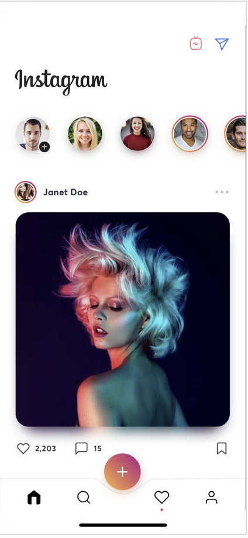
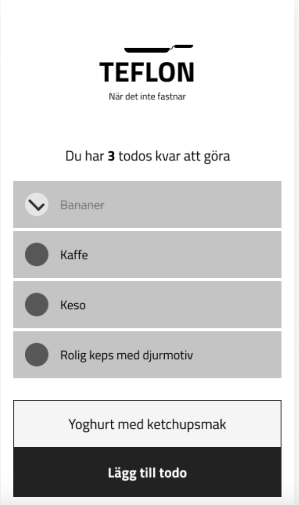

# Component thinking
Denna övning är delad i två delar. Den förat går ut på att analysera en sida för att ta fram lämpliga komponenter. Den andra delen handlar om att implmentera en sida med komponenter.

## DEL 1. Instagram koncept analys
En komponent är en mindre del av en sida som har grafik och egen logik.

I bildan nedan, diskutera i par: 
- Vilka komponenter kan man dela in denna vy i?
- Vad skulle ni döpa komponenterna till?

## DEL 2. Statisk Vue app med komponenter
Första steget i att skapa en dynamisk web app med Vue.js är att koda upp den med statiska komponenter och innehåll. 

Koda upp nedanstående (under teflon todos design) Todo App skiss med dessa komponenter ( håll CSS:en enkel, behöver inte vara lika grafisk som skissen, dock samma funktionalitet och struktur. Notera att todo-header har en komponent ( counter) inuti sig. Glöm inte att hårdkoda in innehållet också i todo-items etc.

Komponenter att använda
- header
  - counter ( "du har 3 todos kvar att göra" )
- todos ( inkl 4 statiska todos )
- new-todo

### Teflon todos design
