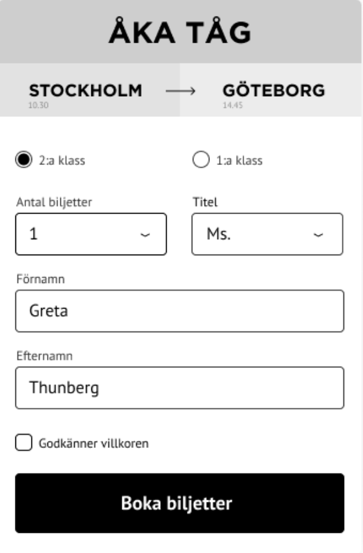

# Props & Data bindning med Traveling agency
two-way ( v-model ), local props, inherited props, v-bind.

## Workshop: Booking form
tekniker: state, local props, v-bind:class ( utmaning 2 ) computed ( utmaning 3)

Koda egen om det behövs tränas lite på forms och HTML etc.
https://www.figma.com/file/XenjCcyq3pZUOa9MF3urqQ/Vue.js-form-exercise-Book-a-flight

Alternativt kan du utgå ifrån följande boilerplate (behöver vueify:as):
https://repl.it/@JohanKivi/Aka-Tag

### Steg 1
Koppla ihop varje datapunkt ( klass, titel, förnamn, efternamn, godkänner ) med lokala state ( data ). Använd v-model. Dubbelkolla att alla formulärelement fungerar med hjälp av Vue Devtools.

### Steg 2
Lyssna efter ett klickevent ( v-on:click / @click ) på knappen. Den ska då console.logga ett objekt med all bokning-data i.

### Utmaning 1
Gör att knappen / klicket inte syns alt. inte fungerar om man inte godkänt villkoren.

### Utmaning 2
Klickar man på pilen ska destinationerna byta plats, alt. pilen vändas. 
D.v.s. resan går från Göteborg till Stockholm.

### Utmaning 3
Validera formuläret ( står det något i namn? Innehåller epost en epostadress? ) Om fälten inte validerar, visa detta i gränssnittet på något sätt. ( ex. röd ram runt input-fältet )

