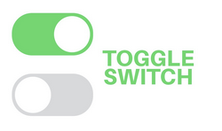

# Övning 1. Toggle switch
Skapa en CSS toggle-komponent som kan toggla av och på med en boolean och bindad class :css=”{ active: active }”. Togglen ska ändra mellan grå ( av ) och grön ( på ).

# Övning 2. Traveling agency ELLER Teflon
Denna övning innebär att först skapa en toggle knapp och sidan koppla den till css klasser. Det är valfritt om du väljer att implementera detta för traveling agency eller teflon appen.

## Steg 1
Förbedelse: Skapa css regler för ett ljust och ett mörkt tema. Detta bör förslagvis vara två klasser med namnen "theme-dark" och "theme-light".

## Steg 1.1
Skapa en knapp som heter "theme" som går att toggla mellan "light" och "dark".

## Steg 2.  
Gör så att knappen ändrar den aktiva klassen för de tema som används på sidan. Observera att tema går att implementera genom att ändra på de css klasser som behöver ändras på för att applicera nya färger i komponenterna.

Tips, se [reactive state management](https://vuejs.org/guide/scaling-up/state-management.html#simple-state-management-with-reactivity-api) för tips på hur du kan implementera detta

## Utmaning 1
Spara det valda temat i localStorage och ladda in det när sidan laddas in på nytt.